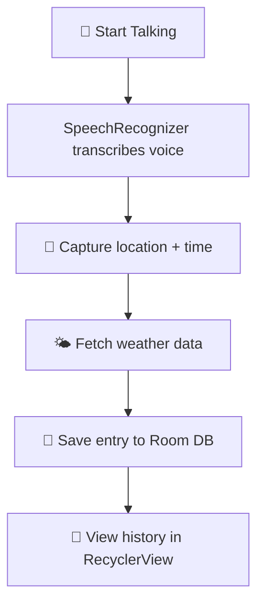
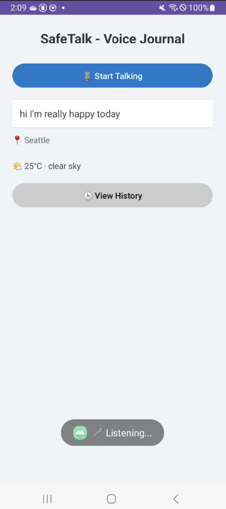
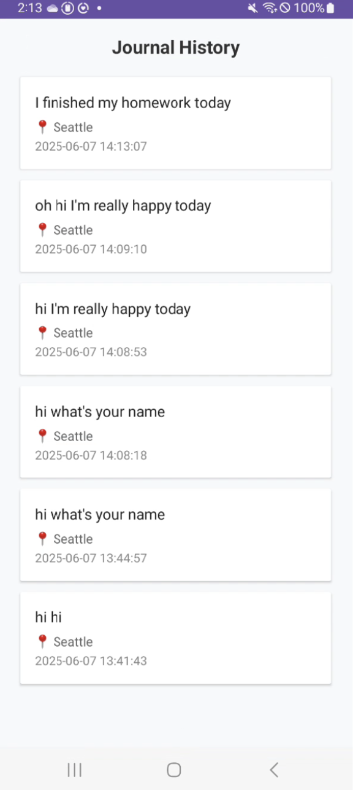

# 🗣️ SafeTalk – Voice Journal with Location Awareness  

  
  
  
  

**SafeTalk** is an Android voice journaling application that allows users to record their thoughts and emotions through speech.  
The app automatically converts speech to text, tags each entry with **time**, **location**, and **weather context**, and stores everything locally.  

---

## 🌟 Features  

- 🎤 **Voice Journaling** – Record voice entries and transcribe speech to text using `SpeechRecognizer`.  
- 📍 **Location & Timestamp** – Captures current city and timestamp automatically.  
- 🌤 **Weather Context** – Fetches local weather via **OpenWeatherMap API** for emotional context.  
- 💾 **Offline Storage** – Saves entries in a **Room Database** for persistent access.  
- 📡 **Connectivity Check** – Detects internet availability before network calls.  
- 🖼 **Modern UI** – Material Design with emoji-based feedback and RecyclerView for history.  

---

## 🛠 Tech Stack  

| Category         | Tools & Frameworks |
|------------------|---------------------|
| **Language**     | Kotlin |
| **Database**     | Room Persistence Library |
| **Networking**   | Retrofit + OpenWeatherMap API |
| **Speech**       | Android `SpeechRecognizer` |
| **Location**     | Google Fused Location Provider |
| **UI**           | RecyclerView, ConstraintLayout, Material Design |
| **Async**        | Kotlin Coroutines |

---

## 🚀 How It Works  

---

## 📱 Screenshots  

| Main Screen | History Screen |
|-------------|----------------|
|  |  |

---

## 🧪 Testing  

- ✅ Functional tests for speech recognition and transcription  
- ✅ Network failure simulation for weather API  
- ✅ Runtime permissions for microphone & location  
- ✅ Room DB persistence tests  
- ✅ Responsive UI tested on multiple screen sizes  

---

## 🧭 Future Improvements  

- 📸 Add photo/mood tags to entries  
- 🔍 Search & filter journal entries  
- ☁️ Cloud sync for backup and cross-device use  
- 🌎 Multilingual speech recognition  
